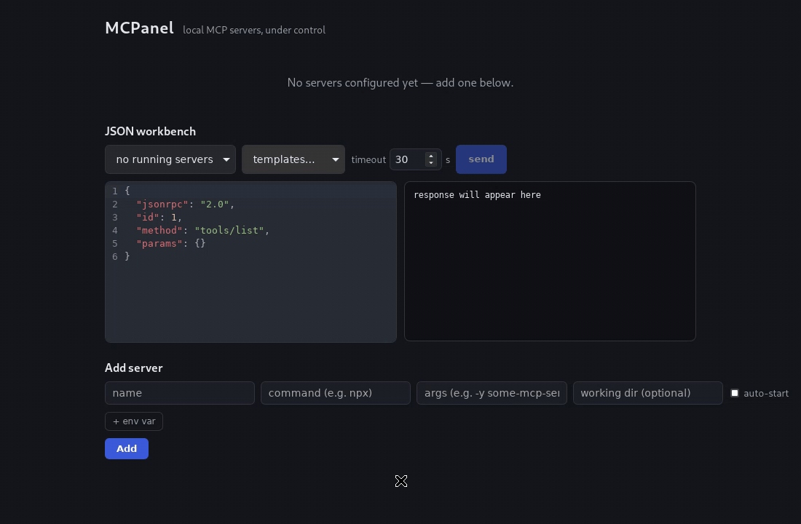

# MCPanel

A lightweight desktop app for managing local MCP (Model Context Protocol) servers — **"Postman for MCP."** No Electron, no bundled runtime, ~7 MB binary.

MCP servers are the small stdio programs that give AI clients access to tools. Today you babysit them with raw terminals, hand-edited JSON configs, and zero visibility. MCPanel gives you a control panel instead.



## Features

- **Service-style toggles.** Flip a server on and MCPanel spawns the process *and* completes the MCP `initialize` handshake before showing it as running. "Running" means it's genuinely ready for tool calls — not just "the process exists."
- **Live log streaming, flood-proof.** stdout/stderr of every server, line by line, ANSI escapes stripped. Oversized lines are capped at 64 KiB and bursts beyond the buffer are counted and reported as dropped — a misbehaving server logging thousands of lines per second can't freeze the UI.
- **JSON-RPC workbench.** A CodeMirror editor to hand-craft JSON-RPC requests, fire them at a running server, and inspect the response — the "Postman" part.
- **No orphaned processes.** Servers are spawned into Unix process groups with PDEATHSIG (Linux) or Windows Job Objects with kill-on-close. If MCPanel exits or crashes, the servers it started die with it.
- **Sane secrets handling.** API keys live in the OS credential manager (Keychain / Windows Credential Manager / Secret Service), never in plaintext config. They're resolved only at spawn time and never appear in logs or events.

## Install

Grab the latest build from [Releases](https://github.com/Q01P/mcpanel/releases).

> **Heads up: builds are currently unsigned.** Your OS will complain the first time. This is expected for a young open-source project — code signing certificates are on the roadmap.

### macOS (Apple Silicon & Intel)

Download the `.dmg`. Gatekeeper will likely claim the app is **"damaged and can't be opened"** — it isn't; that's macOS's message for unsigned downloads. Either:

- Right-click the app → **Open** → **Open** in the dialog, or
- remove the download quarantine attribute:

  ```bash
  xattr -d com.apple.quarantine /Applications/MCPanel.app
  ```

### Windows

Download the `.msi` or `.exe` installer. SmartScreen will warn on first run: click **More info** → **Run anyway**.

### Linux

Download the `.deb`, `.rpm`, or `.AppImage`. The AppImage needs no install: `chmod +x` and run. The deb/rpm packages pull in the WebKitGTK runtime automatically.

## Quickstart

1. Launch MCPanel and click **Add server**.
2. Enter the command and args — e.g. `npx` with args `-y @modelcontextprotocol/server-filesystem /tmp`.
3. Add env vars if the server needs them; mark API keys as **secret** and they go straight to the OS keyring.
4. Flip the toggle. Watch the status walk Starting → Initializing → **Running** while logs stream in below.
5. Open the **workbench**, fire a `tools/list` request, and inspect the response.

That's it — you now have a supervised MCP server with live logs and a request console.

## Build from source

Linux prerequisites:

```bash
sudo apt install libwebkit2gtk-4.1-dev build-essential libxdo-dev libssl-dev \
  libayatana-appindicator3-dev librsvg2-dev
```

Then (Rust stable ≥ 1.95 and Node 20+ required):

```bash
npm ci && npm run build        # required once before any cargo command —
                               # the Tauri build embeds dist/ at compile time
npm run tauri dev              # dev app: vite on :1420 + the Rust backend
```

Tests and checks:

```bash
cargo test   --locked --manifest-path src-tauri/Cargo.toml
cargo clippy --locked --manifest-path src-tauri/Cargo.toml --all-targets -- -D warnings
npm test && npm run lint && npm run typecheck
```

## Security model

The UI talks to the backend over a local HTTP gateway. In short:

- The gateway binds `127.0.0.1` on an ephemeral port — never an external interface.
- Every request needs a random 32-byte bearer token, generated fresh per launch, held in memory only, and compared in constant time.
- The `Host` header is validated against the bound address to block DNS-rebinding attacks.
- CORS is pinned to the app's own webview origins — browsers can't script against the gateway.
- Secrets are resolved from the OS keyring just-in-time at process spawn; they are never written to config, events, or logs.

Found a vulnerability? See [SECURITY.md](SECURITY.md) — please report privately.

## Known limitations

- On Unix, if MCPanel itself is SIGKILLed, a reparented grandchild process can survive (PDEATHSIG covers direct children only). Normal exits and crashes are fully covered.
- Windows graceful shutdown is compile-verified but untested on real hardware and likely degrades to grace-then-terminate. **Windows testers wanted** — if you can try it on a real box, [open an issue](https://github.com/Q01P/mcpanel/issues) with what you find.

## Contributing

See [CONTRIBUTING.md](CONTRIBUTING.md) for setup, test commands, and PR conventions. Scoped changes, one concern per PR.

## License

[MIT](LICENSE) © Oussema Taleb
