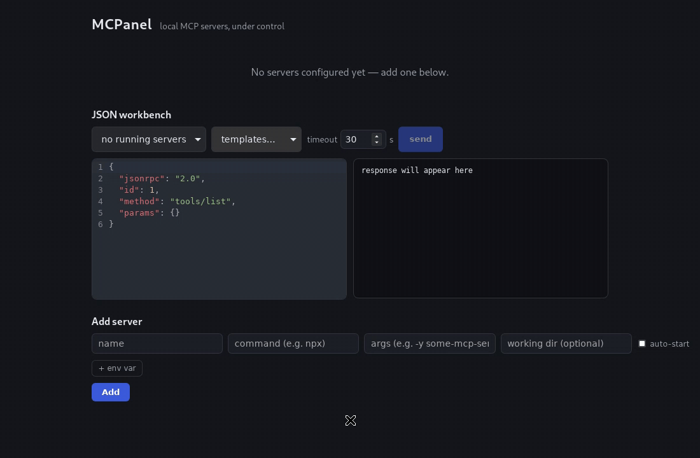

# MCPanel

A lightweight desktop app for managing local MCP (Model Context Protocol) servers: **"Postman for MCP."** No Electron, no bundled runtime, ~7 MB binary.

MCP servers are the small stdio programs that give AI clients access to tools. Today you babysit them with raw terminals, hand-edited JSON configs, and zero visibility. MCPanel gives you a control panel instead.



## Features

- **Import from the clients you already use.** MCPanel reads the MCP servers already configured in Claude Desktop, Claude Code, Cursor, VS Code, and Windsurf, and offers them for import — no retyping. Credential-looking environment variables are moved straight from those plaintext config files into your OS keyring on the way in.
- **Service-style toggles.** Flip a server on and MCPanel spawns the process *and* completes the MCP `initialize` handshake before showing it as running. "Running" means it's genuinely ready for tool calls, not just "the process exists."
- **Live log streaming, flood-proof.** stdout/stderr of every server, line by line, ANSI escapes stripped. Oversized lines are capped at 64 KiB and bursts beyond the buffer are counted and reported as dropped, so a misbehaving server logging thousands of lines per second can't freeze the UI.
- **Tools browser.** Pick a running server and its tools are listed; pick a tool and its `inputSchema` becomes a form — strings, numbers, booleans, enums as the right controls, anything richer as a JSON field — with strict typing on the way out (`"12abc"` is not a number, `1.5` is not an integer, an empty optional is omitted rather than sent as `""`). Call it and read the result as text, not as an envelope. This is the "Postman" part.
- **Resources and prompts browsers.** Two more tabs over the same session: list and read resources (URI templates become a form; text, JSON, and binary contents are rendered by type), list prompts and get them with their arguments filled in. Both follow the server's `list_changed` notifications.
- **Raw JSON-RPC editor.** One tab over: a CodeMirror editor to hand-craft any request and inspect the exact response. Every browser call lands in the shared history as the JSON-RPC it amounted to, **open in editor** hands it over for tweaking, and history survives restarts with one-click re-run.
- **It tells you why a start failed.** Servers are spawned with your login shell's PATH merged in (so `nvm`, `uv`, and Homebrew tools work from a Finder or desktop launch), and the command is resolved before spawn: a miss says "command not found: npx" and what was searched, never `os error 2`. While running, the row shows the server's name, version, protocol revision, and capabilities from the handshake.
- **Restart, timeouts, and crash recovery.** A restart button for the edit → restart → retest loop; a per-server timeout that bounds the handshake (cold `npx -y` installs are slow) and every request; and opt-in restart-on-crash with exponential backoff that a deliberate stop cancels.
- **Context cost at a glance.** The tools browser estimates the tokens each tool and the whole list cost a client, flags over-long descriptions, and shows tool annotations (read-only, destructive, idempotent, open world) as badges.
- **Export to the clients you use.** The reverse of import: the selected servers as a `mcpServers` or VS Code `servers` document to copy or save as a new file. Secrets stay in the keyring as `${KEY}` placeholders unless you explicitly include them.
- **No orphaned processes.** Servers are spawned into Unix process groups with PDEATHSIG (Linux) or Windows Job Objects with kill-on-close. If MCPanel exits or crashes, the servers it started die with it.
- **Sane secrets handling.** API keys live in the OS credential manager (Keychain / Windows Credential Manager / Secret Service), never in plaintext config. They're resolved only at spawn time and never appear in logs or events.

## Install

Grab the latest build from [Releases](https://github.com/Q01P/mcpanel/releases).

> **Heads up: builds are currently unsigned.** Your OS will complain the first time. This is expected for a young open-source project; code signing certificates are on the roadmap.

### macOS (Apple Silicon & Intel)

Download the `.dmg`. Gatekeeper will likely claim the app is **"damaged and can't be opened."** It isn't; that's macOS's message for unsigned downloads. Either:

- Right-click the app → **Open** → **Open** in the dialog, or
- remove the download quarantine attribute:

  ```bash
  xattr -d com.apple.quarantine /Applications/MCPanel.app
  ```

### Windows

Download the `.msi` or `.exe` installer. SmartScreen will warn on first run: click **More info** → **Run anyway**.

### Linux

Download the `.deb`, `.rpm`, or `.AppImage`. The AppImage needs no install: `chmod +x` and run. The deb/rpm packages pull in the WebKitGTK runtime automatically.

## Quickstart

1. Launch MCPanel and click **Import…** — if you already run MCP servers in another client, they're listed and ready to bring over. Otherwise click **Add server**.
2. Enter the command and args, e.g. `npx` with args `-y @modelcontextprotocol/server-filesystem /tmp`.
3. Add env vars if the server needs them; mark API keys as **secret** and they go straight to the OS keyring.
4. Flip the toggle. Watch the status walk Starting → Initializing → **Running** while logs stream in below.
5. In the **workbench**, pick a tool from the list, fill in its inputs, and click **call**. The **Resources** and **Prompts** tabs work the same way; switch to **Raw JSON-RPC** when you want to hand-craft the request yourself.
6. Click **Export…** to hand the same servers to Claude Desktop, Cursor, or VS Code as a config snippet.

That's it: you now have a supervised MCP server with live logs and a request console.

## Build from source

Linux prerequisites:

```bash
sudo apt install libwebkit2gtk-4.1-dev build-essential libxdo-dev libssl-dev \
  libayatana-appindicator3-dev librsvg2-dev
```

Then (Rust stable ≥ 1.95 and Node 22+ required):

```bash
npm ci && npm run build        # required once before any cargo command:
                               # the Tauri build embeds dist/ at compile time
npm run tauri dev              # dev app: vite on :1420 + the Rust backend
```

Tests and checks:

```bash
cargo test   --locked --manifest-path src-tauri/Cargo.toml
cargo clippy --locked --manifest-path src-tauri/Cargo.toml --all-targets -- -D warnings
npm test && npm run lint && npm run typecheck
```

## Security model

The UI talks to the backend over a local HTTP gateway. In short:

- The gateway binds `127.0.0.1` on an ephemeral port, never an external interface.
- Every request needs a random 32-byte bearer token, generated fresh per launch, held in memory only, and compared in constant time.
- The `Host` header is validated against the bound address to block DNS-rebinding attacks.
- CORS is pinned to the app's own webview origins, so browsers can't script against the gateway.
- Secrets are resolved from the OS keyring just-in-time at process spawn; they are never written to config, events, or logs.

Found a vulnerability? See [SECURITY.md](SECURITY.md) and please report privately.

## Importing from other clients

**Import…** scans the standard config locations for Claude Desktop, Claude Code
(`~/.claude.json`), Cursor, VS Code, and Windsurf. If yours lives somewhere else
— a project-local `.mcp.json`, say — paste its path into the dialog.

- **Only stdio servers can be imported.** Entries with a `url` or an `http`/`sse`
  transport are listed with the reason they were skipped rather than silently
  dropped; see the limitation below.
- **Credentials go to the keyring, not to MCPanel's config.** Environment
  variables whose names look like credentials (`*_TOKEN`, `*_API_KEY`,
  `*_SECRET`, `*_PASSWORD`, …) are written to the OS credential manager and
  stored here only as a marker. Their values are read from the source file
  backend-side and never reach the UI.
- **Nothing is overwritten.** A name that's already taken is imported as
  `name (2)`, and the dialog says so before and after. Imported servers are
  never armed to auto-start.
- **Your original config is untouched.** Import only reads.

## Known limitations

- **Import covers stdio servers only.** Remote (`http`/`sse`) MCP servers in a
  client's config are reported as skipped, because MCPanel itself speaks stdio
  only — remote transport support is on the roadmap, along with profiles and a
  transparent stdio proxy (see `docs/user-research-2026-09.md`).
- **Export never touches another client's file.** It produces text to paste or
  a new file to merge by hand; keeping several clients in sync automatically is
  not yet a feature.
- The login-shell PATH probe runs `$SHELL -ilc` once per launch with a 3 s
  bound; a shell profile that prints or prompts on start is skipped silently
  and the app's own PATH is used.
- On Unix, if MCPanel itself is SIGKILLed, a reparented grandchild process can survive (PDEATHSIG covers direct children only). Normal exits and crashes are fully covered.
- Windows graceful shutdown is compile-verified but untested on real hardware and likely degrades to grace-then-terminate. **Windows testers wanted:** if you can try it on a real box, [open an issue](https://github.com/Q01P/mcpanel/issues) with what you find.

## Contributing

See [CONTRIBUTING.md](CONTRIBUTING.md) for setup, test commands, and PR conventions. Scoped changes, one concern per PR.

## License

[MIT](LICENSE) © Oussema Taleb
